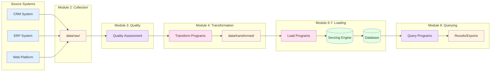
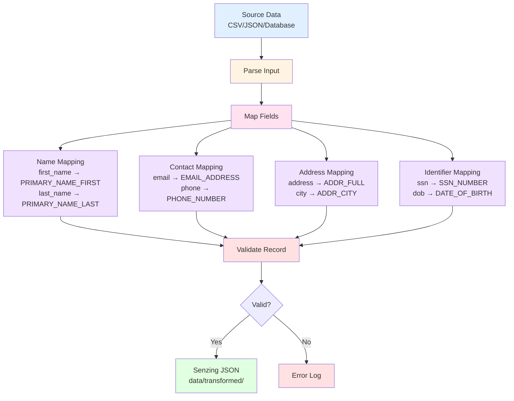
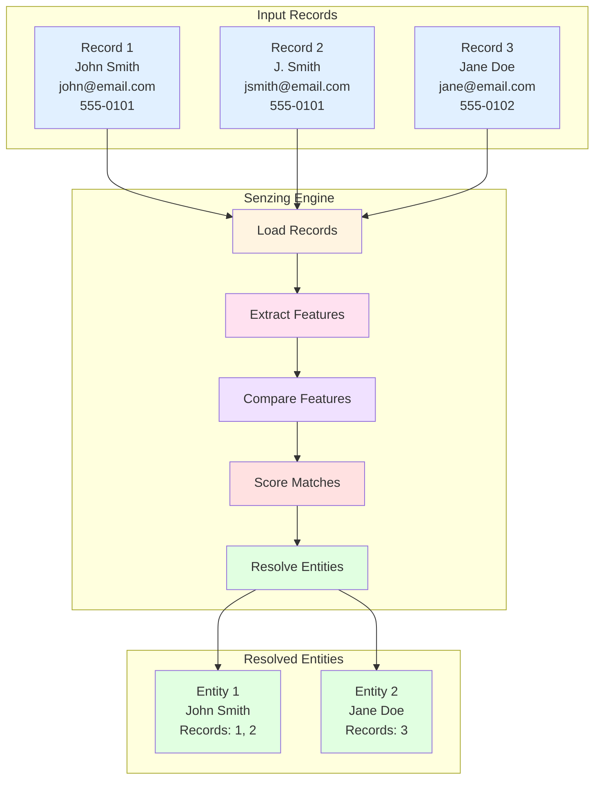
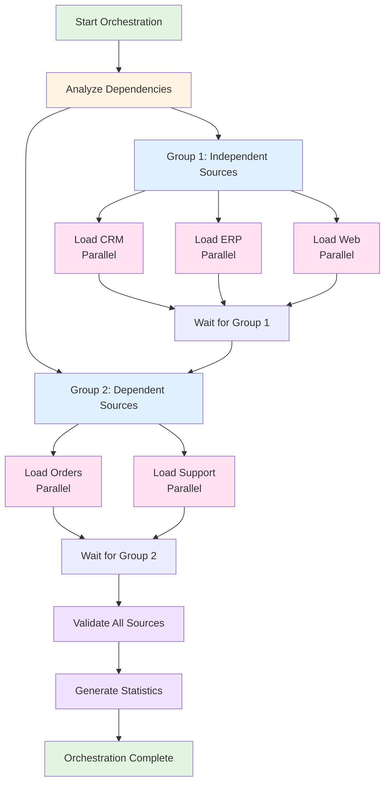
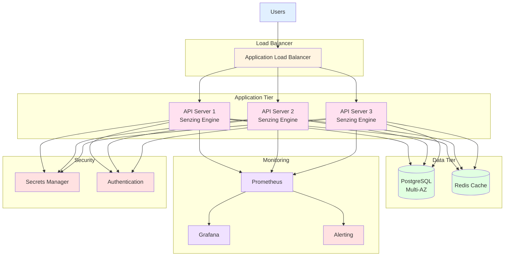
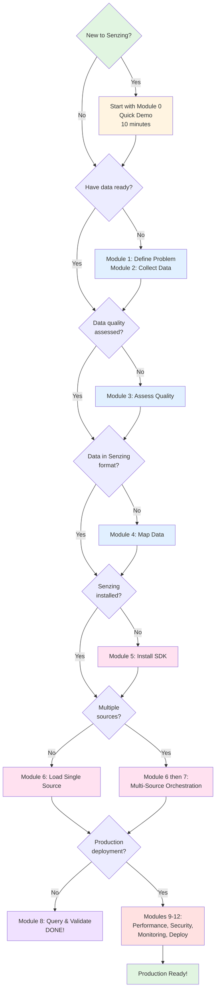
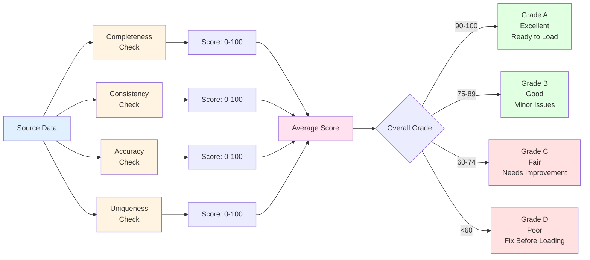

# Visual Guide: Senzing Boot Camp

This guide provides visual diagrams to help understand the boot camp flow, data transformations, and architecture patterns.

## Boot Camp Flow Diagram

```mermaid
graph TD
    Start[Start Boot Camp] --> M0{Want Quick Demo?}
    M0 -->|Yes| Module0[Module 0: Quick Demo<br/>10-15 min]
    M0 -->|No| Module1
    Module0 --> Module1

    Module1[Module 1: Business Problem<br/>20-30 min] --> Module2[Module 2: Collect Data<br/>10-15 min per source]
    Module2 --> Module3[Module 3: Data Quality<br/>15-20 min per source]
    Module3 --> M4{Data SGES<br/>Compliant?}

    M4 -->|No| Module4[Module 4: Map Data<br/>1-2 hrs per source]
    M4 -->|Yes| Module5
    Module4 --> Module5

    Module5[Module 5: SDK Setup<br/>30 min - 1 hr] --> Module6[Module 6: Load Single Source<br/>30 min per source]

    Module6 --> M7{Multiple<br/>Sources?}
    M7 -->|Yes| Module7[Module 7: Multi-Source<br/>Orchestration<br/>1-2 hrs]
    M7 -->|No| Module8
    Module7 --> Module8

    Module8[Module 8: Query & Validate<br/>1-2 hrs] --> M9{Production<br/>Deployment?}

    M9 -->|No| Complete[Boot Camp Complete!]
    M9 -->|Yes| Module9[Module 9: Performance<br/>Testing<br/>1-2 hrs]

    Module9 --> Module10[Module 10: Security<br/>Hardening<br/>1-2 hrs]
    Module10 --> Module11[Module 11: Monitoring<br/>1-2 hrs]
    Module11 --> Module12[Module 12: Deploy<br/>2-3 hrs]
    Module12 --> Complete

    style Start fill:#e1f5e1
    style Complete fill:#e1f5e1
    style Module0 fill:#fff4e1
    style Module1 fill:#e1f0ff
    style Module2 fill:#e1f0ff
    style Module3 fill:#e1f0ff
    style Module4 fill:#e1f0ff
    style Module5 fill:#ffe1f0
    style Module6 fill:#ffe1f0
    style Module7 fill:#ffe1f0
    style Module8 fill:#f0e1ff
    style Module9 fill:#ffe1e1
    style Module10 fill:#ffe1e1
    style Module11 fill:#ffe1e1
    style Module12 fill:#ffe1e1
```



## Data Flow Diagram



## Transformation Process



## Entity Resolution Process



## Multi-Source Orchestration



## Production Architecture



## Decision Tree: Which Path to Take?



## Module Dependencies

```mermaid
graph LR
    M0[Module 0<br/>Quick Demo<br/>Optional] -.-> M1

    M1[Module 1<br/>Business Problem<br/>Required] --> M2[Module 2<br/>Collect Data<br/>Required]

    M2 --> M3[Module 3<br/>Data Quality<br/>Required]

    M3 --> M4[Module 4<br/>Map Data<br/>Conditional]
    M3 -.->|SGES Data| M5

    M4 --> M5[Module 5<br/>SDK Setup<br/>Required]

    M5 --> M6[Module 6<br/>Load Single<br/>Required]

    M6 --> M7[Module 7<br/>Multi-Source<br/>Conditional]
    M6 -.->|Single Source| M8

    M7 --> M8[Module 8<br/>Query/Validate<br/>Required]

    M8 -.->|Dev Only| End[Complete]
    M8 --> M9[Module 9<br/>Performance<br/>Production Only]

    M9 --> M10[Module 10<br/>Security<br/>Production Only]

    M10 --> M11[Module 11<br/>Monitoring<br/>Production Only]

    M11 --> M12[Module 12<br/>Deploy<br/>Production Only]

    M12 --> End

    style M0 fill:#fff4e1
    style M1 fill:#e1f0ff
    style M2 fill:#e1f0ff
    style M3 fill:#e1f0ff
    style M4 fill:#e1f0ff
    style M5 fill:#ffe1f0
    style M6 fill:#ffe1f0
    style M7 fill:#ffe1f0
    style M8 fill:#f0e1ff
    style M9 fill:#ffe1e1
    style M10 fill:#ffe1e1
    style M11 fill:#ffe1e1
    style M12 fill:#ffe1e1
    style End fill:#e1f5e1
```



## Time Estimates by Path

```mermaid
gantt
    title Boot Camp Time Estimates
    dateFormat X
    axisFormat %H:%M

    section Quick Demo
    Module 0 :0, 15m

    section Fast Track
    Module 5 SDK Setup :0, 60m
    Module 6 Load Data :60m, 30m
    Module 8 Query :90m, 60m

    section Complete Path
    Module 1 Problem :0, 30m
    Module 2 Collect :30m, 45m
    Module 3 Quality :75m, 60m
    Module 4 Mapping :135m, 120m
    Module 5 SDK :255m, 60m
    Module 6 Load :315m, 30m
    Module 8 Query :345m, 120m

    section Production Path
    Modules 1-8 :0, 465m
    Module 9 Performance :465m, 120m
    Module 10 Security :585m, 120m
    Module 11 Monitoring :705m, 120m
    Module 12 Deploy :825m, 180m
```

## Data Quality Scoring



## Using These Diagrams

### In Documentation

These diagrams are embedded in markdown files and render automatically in:

- GitHub
- GitLab
- VS Code (with Mermaid extension)
- Most modern markdown viewers

### Exporting

To export as images:

1. Use online tools like [Mermaid Live Editor](https://mermaid.live/)
2. Use VS Code with Mermaid extension
3. Use command-line tools like `mmdc`

### Customizing

To customize diagrams:

1. Copy the mermaid code block
2. Modify node names, connections, or styles
3. Test in Mermaid Live Editor
4. Update documentation

## Related Documentation

- [POWER.md](../../POWER.md) - Boot camp overview
- [QUICK_START.md](QUICK_START.md) - Getting started guide
- [PROGRESS_TRACKER.md](PROGRESS_TRACKER.md) - Track your progress

## Version History

- **v1.0.0** (2026-03-17): Visual guide created with Mermaid diagrams
